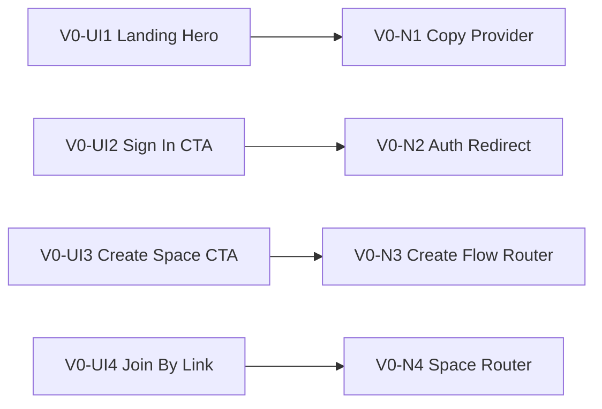
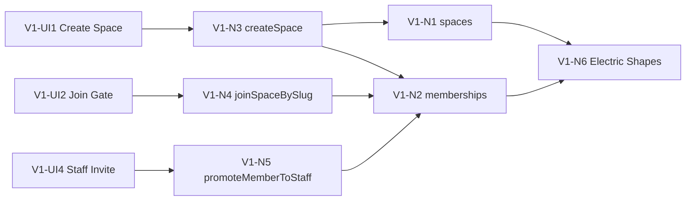
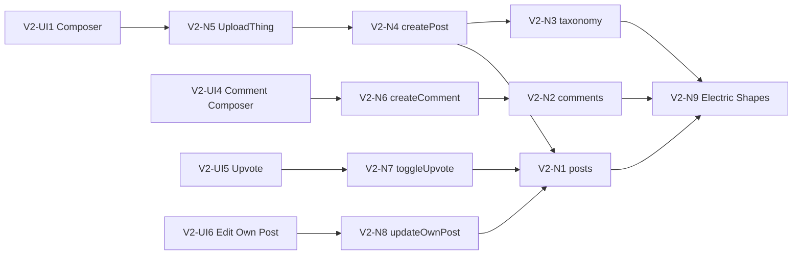
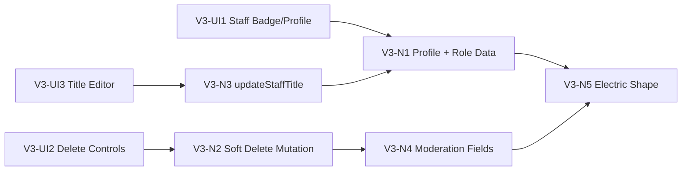
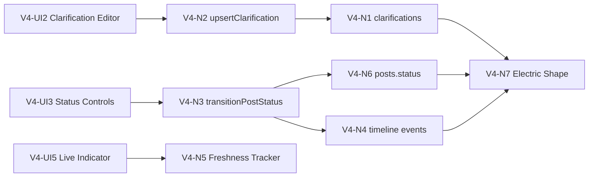
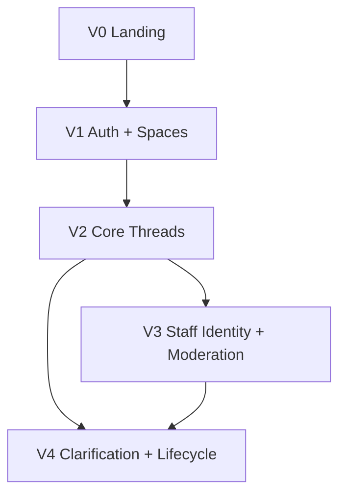

# Product Feedback Community Platform - Slices

## Selected Shape

Shape A: Unified Thread with Staff Clarification Overlay

## Slice Definitions

| Slice | Goal | Requirements Covered | Shape Parts Covered | Demo Outcome |
|-------|------|----------------------|---------------------|--------------|
| V0 | Publish a public landing page with clear entry points. | R1.1 | A10 | Visitors can understand product value and navigate to sign in, create space, or join by link. |
| V1 | Establish auth, space creation, membership, and join-by-link flow. | R1, R2, R3 | A1, A2, A3 | Authenticated user can create a space and another user can join it via link. |
| V2 | Deliver core community thread behaviors and content model. | R0, R4, R8 | A5, A6 | Users can create rich posts with image/category/tags, comment, upvote, and edit own post. |
| V3 | Add staff identity visibility and moderation controls. | R5 (+ identity portion of R0 trust) | A4, A7 | Staff identity is clearly visible; staff can delete posts/comments with audit trail. |
| V4 | Add clarification document and lifecycle status workflow with live multi-user sync behavior polished. | R6, R7 (+ live-sync emphasis) | A8, A9 | Staff can publish clarification above thread and move post through suggestion -> selected -> beta -> GA in real time. |

## Dependency Order

| Slice | Depends On | Reason |
|-------|------------|--------|
| V0 | None | Marketing/entry route is independent and can ship first. |
| V1 | V0 | Landing CTAs route into auth and space flows created in V1. |
| V2 | V1 | Posts/comments/upvotes require authenticated, scoped space membership. |
| V3 | V2 | Moderation and identity are layered on existing thread interactions. |
| V4 | V2, V3 | Clarification and status workflow are staff features on top of complete thread + moderation surface. |

## V0 Breadboard: Landing Page

### UI Affordances

| ID | Place | Affordance | User | Wires Out |
|----|-------|------------|------|-----------|
| V0-UI1 | `/` | Landing hero with value statement and social proof placeholder | Visitor | V0-N1 |
| V0-UI2 | `/` | `Sign in` CTA (Google/GitHub path) | Visitor | V0-N2 |
| V0-UI3 | `/` | `Create a space` CTA | Authenticated user | V0-N3 |
| V0-UI4 | `/` | `Join existing space` input (`spaceSlug`) + continue button | Visitor/Auth user | V0-N4 |

### Non-UI Affordances

| ID | Place | Affordance | Type | Wires Out |
|----|-------|------------|------|-----------|
| V0-N1 | Route loader | Landing copy/config provider | Client module | — |
| V0-N2 | Auth client | Social sign-in redirect trigger | Auth integration | — |
| V0-N3 | Router | Navigate to create-space flow if authenticated; otherwise sign-in | Client handler | — |
| V0-N4 | Router | Resolve `/s/:spaceSlug` navigation from input | Client handler | — |

### Wiring

## V1 Breadboard: Auth, Spaces, Membership

### UI Affordances

| ID | Place | Affordance | User | Wires Out |
|----|-------|------------|------|-----------|
| V1-UI1 | `/spaces/new` | Create Space form (`name`, `slug`, `description`) | Authenticated user | V1-N3 |
| V1-UI2 | `/s/:spaceSlug` | Join gate screen with context and join action | Authenticated user | V1-N4 |
| V1-UI3 | `/s/:spaceSlug` | Space shell (header, nav, membership-aware page state) | Member | V1-N1, V1-N2 |
| V1-UI4 | `/s/:spaceSlug/settings/members` | Add colleague to staff role form | Staff | V1-N5 |

### Non-UI Affordances

| ID | Place | Affordance | Type | Wires Out |
|----|-------|------------|------|-----------|
| V1-N1 | TanStack DB | `spaces` collection scoped to user memberships | Client collection | V1-N6 |
| V1-N2 | TanStack DB | `memberships` collection with role metadata | Client collection | V1-N6 |
| V1-N3 | Mutation | `createSpace` optimistic mutation + owner membership bootstrap | Client mutation | V1-N1, V1-N2 |
| V1-N4 | Mutation | `joinSpaceBySlug` idempotent membership upsert as `user` | Client mutation | V1-N2 |
| V1-N5 | Mutation | `promoteMemberToStaff` guarded mutation | Trusted boundary + client trigger | V1-N2 |
| V1-N6 | ElectricSQL | Shapes for `spaces`, `memberships`, `profiles` by current user membership | Sync shape | — |

### Wiring

## V2 Breadboard: Core Posts, Comments, Upvotes, Taxonomy, Images

### UI Affordances

| ID | Place | Affordance | User | Wires Out |
|----|-------|------------|------|-----------|
| V2-UI1 | `/s/:spaceSlug/new` | Rich post composer with category/tags/image | Member | V2-N4, V2-N5 |
| V2-UI2 | `/s/:spaceSlug` | Post list with vote counts and category/tag chips | Member | V2-N1 |
| V2-UI3 | `/s/:spaceSlug/p/:postId` | Post detail thread with comments | Member | V2-N1, V2-N2 |
| V2-UI4 | `/s/:spaceSlug/p/:postId` | Comment composer | Member | V2-N6 |
| V2-UI5 | Post cards/detail | Upvote toggle button | Member | V2-N7 |
| V2-UI6 | Own post actions | Edit post action and editor | Post author | V2-N8 |

### Non-UI Affordances

| ID | Place | Affordance | Type | Wires Out |
|----|-------|------------|------|-----------|
| V2-N1 | TanStack DB | `posts` collection with rich text, image URL, category, status | Client collection | V2-N9 |
| V2-N2 | TanStack DB | `comments` collection keyed by `postId` | Client collection | V2-N9 |
| V2-N3 | TanStack DB | `categories`, `tags`, `post_tags` collections | Client collection | V2-N9 |
| V2-N4 | Mutation | `createPost` optimistic insert + validation | Client mutation | V2-N1, V2-N3 |
| V2-N5 | UploadThing | image upload client + upload metadata return | Upload integration | V2-N4 |
| V2-N6 | Mutation | `createComment` optimistic insert | Client mutation | V2-N2 |
| V2-N7 | Mutation | `toggleUpvote` optimistic count delta + per-user upvote record | Client mutation | V2-N1 |
| V2-N8 | Mutation | `updateOwnPost` optimistic patch with author guard | Client mutation | V2-N1 |
| V2-N9 | ElectricSQL | Shapes for posts/comments/upvotes/categories/tags by `spaceId` | Sync shape | — |

### Wiring

## V3 Breadboard: Staff Identity + Moderation

### UI Affordances

| ID | Place | Affordance | User | Wires Out |
|----|-------|------------|------|-----------|
| V3-UI1 | Post/comment author row | Staff badge + title + profile popover | All users | V3-N1 |
| V3-UI2 | Post/comment actions | Staff-only delete controls | Staff | V3-N2 |
| V3-UI3 | `/s/:spaceSlug/settings/members` | Staff title editor | Staff | V3-N3 |
| V3-UI4 | Post/comment body | Deleted-content placeholder with moderation marker | All users | V3-N2 |

### Non-UI Affordances

| ID | Place | Affordance | Type | Wires Out |
|----|-------|------------|------|-----------|
| V3-N1 | TanStack DB | `profiles` + membership role/title projections | Client collection | V3-N5 |
| V3-N2 | Mutation | `softDeletePost` and `softDeleteComment` with actor metadata | Trusted mutation | V3-N4 |
| V3-N3 | Mutation | `updateStaffTitle` guarded by staff role | Trusted mutation | V3-N1 |
| V3-N4 | TanStack DB | Soft-delete fields (`deletedAt`, `deletedBy`, `deleteReason`) on posts/comments | Client collection | V3-N5 |
| V3-N5 | ElectricSQL | Shape updates to include moderation and profile title fields | Sync shape | — |

### Wiring

## V4 Breadboard: Clarification + Lifecycle + Live Sync Polish

### UI Affordances

| ID | Place | Affordance | User | Wires Out |
|----|-------|------------|------|-----------|
| V4-UI1 | Top of post detail | Clarification panel ("Product Understanding") | All users | V4-N1 |
| V4-UI2 | Top of post detail | Clarification editor (staff only) | Staff | V4-N2 |
| V4-UI3 | Post header/list card | Status badge + transition controls | Staff/All users | V4-N3 |
| V4-UI4 | Post detail | Lifecycle timeline (`suggestion -> selected -> beta -> ga`) | All users | V4-N4 |
| V4-UI5 | Post list/detail | Live-sync activity indicator (recent updates) | All users | V4-N5 |

### Non-UI Affordances

| ID | Place | Affordance | Type | Wires Out |
|----|-------|------------|------|-----------|
| V4-N1 | TanStack DB | `clarifications` current version projection by `postId` | Client collection | V4-N7 |
| V4-N2 | Mutation | `upsertClarification` with immutable link to original post content | Trusted mutation | V4-N1 |
| V4-N3 | Mutation | `transitionPostStatus` with allowed state machine rules | Trusted mutation | V4-N6 |
| V4-N4 | TanStack DB | `post_timeline_events` collection | Client collection | V4-N7 |
| V4-N5 | Client sync monitor | Realtime freshness tracker for visible entities | Client module | — |
| V4-N6 | TanStack DB | `posts.status` and `statusChangedAt` projection | Client collection | V4-N7 |
| V4-N7 | ElectricSQL | Shapes for clarifications and timeline/status updates by `spaceId` | Sync shape | — |

### Wiring

## Sliced Breadboard Overview

## Completion Criteria Per Slice

| Slice | Exit Criteria |
|-------|---------------|
| V0 | `/` route is shippable and routes correctly to auth/create/join actions. |
| V1 | End-to-end space creation and join-by-link works with role-scoped membership. |
| V2 | Core thread interactions work with local-first optimistic updates and live replication. |
| V3 | Staff identity and moderation are visible and enforced with audit-safe deletes. |
| V4 | Clarification + lifecycle workflow is complete and visibly live across concurrent clients. |
